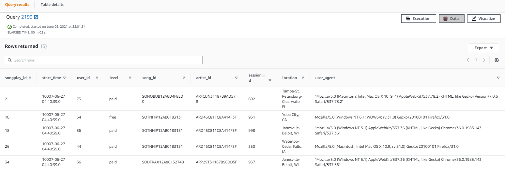
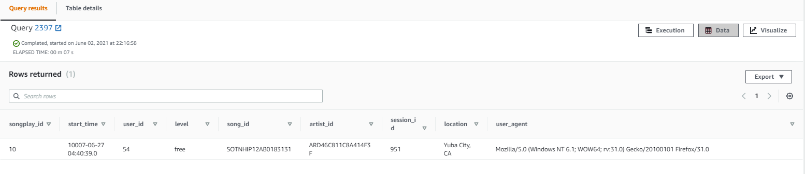

<h1 align="center">Data Warehouse</h1>


## Summary

A music streaming startup, Sparkify, has grown their user base and song database and want to move their processes and data onto the cloud. Their data resides in S3, in a directory of JSON logs on user activity on the app, as well as a directory with JSON metadata on the songs in their app.

As their data engineer, you are tasked with building an ETL pipeline that extracts their data from S3, stages them in Redshift, and transforms data into a set of dimensional tables for their analytics team to continue finding insights in what songs their users are listening to. You'll be able to test your database and ETL pipeline by running queries given to you by the analytics team from Sparkify and compare your results with their expected results.

## Project Description

In this project, we will build a datawarehouse on AWS and build an ETL pipeline for a database hosted on Redshift. The data is loaded from S3 to staging tables on Redshift and modeled into fact and dimensions tables to perform analytics and obtain meaningful insights.


## Dataset
#### Song Dataset
The first dataset is a subset of real data from the [Million Song Dataset](http://millionsongdataset.com/).  Each file in the dataset is in JSON format and contains meta-data about a song and the artist of that song. The files are partitioned by the first three letters of each song's track ID. For example, here are filepaths to two files in this dataset.

```
song_data/A/B/C/TRABCEI128F424C983.json
song_data/A/A/B/TRAABJL12903CDCF1A.json
```


An example of what a single song file :
```
{"num_songs": 1, "artist_id": "ARJIE2Y1187B994AB7", "artist_latitude": null, "artist_longitude": null, "artist_location": "", "artist_name": "Line Renaud", "song_id": "SOUPIRU12A6D4FA1E1", "title": "Der Kleine Dompfaff", "duration": 152.92036, "year": 0}
```

#### Log Dataset
The second dataset consists of log files in JSON format generated by this [Event Simulator](https://github.com/Interana/eventsim) based on the songs in the dataset above. These simulate app activity logs from an imaginary music streaming app based on configuration settings.

The log files in the dataset you'll be working with are partitioned by year and month. For example, here are filepaths to two files in this dataset.
```
log_data/2018/11/2018-11-12-events.json
log_data/2018/11/2018-11-13-events.json
```

And below is an example of what the data in a log file, 2018-11-12-events.json, looks like.:


## Database Schema Design and ETL Pipeline

### Data Model

The database is designed using a **star schema** consisting of fact and dimension tables. There is one fact table (**songplays**) containing all the metrics associated with each event user's actions, and four dimensions tables, containing associated information such as **users, songs, artists** and **time**. This model enables us to get value out of the data faster and easier since we don't need complex joins when querying data. 


## ETL pipeline
1. Load song and log data both from S3 buckets.
2. Stage the loaded data.
3. Transform the data into the above described data schema.

## Project structure

Files in this repository:

- `create_tables.py` Drops and creates tables on AWS Redshift (Reset the tables)
- `etl.py` Stages and transforms the data from S3 buckets and loads them into tables
- `sql_queries.py` Contains the SQL queries for staging, schema definition and ETL
- `dwh.cfg` Configuration file used that contains info about Redshift, IAM and S3
- `README.md`  Discussion on the process and decisions of ETL pipeline
- `images` Folder at the root of the project, where images are stored
- `Iac.ipynb` Infrastructure-as-code to create Redshift Cluster using the AWS python SDK


## Getting Started


### Prerequisites

* python
* PostgreSQL
* AWS account
* psycopg2 python library
* boto3 python library

### How to run

Follow the steps to extract and load the data into the data model.

1. Setup a redshift cluster on AWS with `Iac.ipynb` and insert the connection details in `dwh.cfg`.


2. Execute `create_tables.py` to create/reset the tables

   ```python
   python create_tables.py
   ```

3. Execute ETL process and load data into database to execute SQL queries corresponding to staging data from S3 on Redshift and to transform and insert into the Postgres tables on Redshift

   ```python
   python etl.py
   ```

4. Check whether the data has been loaded into database by using Query Editor in the AWS Redshift console


#### Example Query Results


1. `sql SELECT * FROM songplays LIMIT 5;`

 


2. `%sql SELECT * FROM songplays WHERE level = 'free' and location = 'Yuba City, CA';`

 